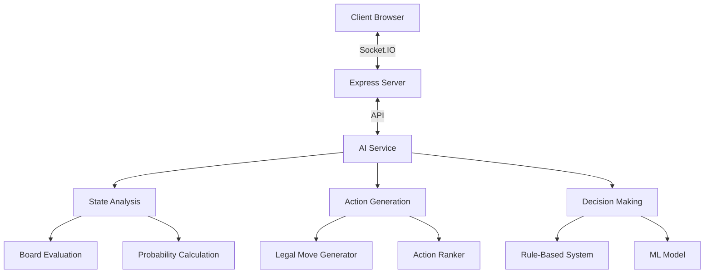

# AI Implementation Guide

This guide provides practical advice for implementing AI enhancements in the Pokemon TCG Simulator. It covers the technical aspects of integrating AI into the existing codebase.

## Game State Representation

The first step in implementing AI is to create a clean representation of the game state that AI systems can easily process.

### Core Game State Object

```javascript
/**
 * A simplified representation of the game state for AI consumption
 */
class GameState {
  constructor() {
    this.players = {
      self: {
        active: null,
        bench: [],
        hand: [],
        deck: { count: 0, knownCards: [] },
        discard: [],
        prizes: { count: 0, knownCards: [] },
        lostZone: [],
      },
      opponent: {
        active: null,
        bench: [],
        hand: { count: 0, knownCards: [] },
        deck: { count: 0 },
        discard: [],
        prizes: { count: 0 },
        lostZone: [],
      },
    };
    this.stadium = null;
    this.turn = 0;
    this.activePlayer = 'self';
    this.lastAction = null;
    this.possibleActions = [];
  }

  /**
   * Create a GameState object from the systemState and zone arrays
   */
  static fromSystemState(systemState, selfZones, oppZones) {
    // Implementation details
  }

  /**
   * Get a list of all possible actions in the current state
   */
  getPossibleActions() {
    // Implementation details
  }

  /**
   * Apply an action to the game state and return the new state
   */
  applyAction(action) {
    // Implementation details
  }
}
```

### Card Representation

```javascript
/**
 * A simplified representation of a card for AI consumption
 */
class Card {
  constructor(id, name, type, subtype, hp, energyCost, abilities, attacks) {
    this.id = id;
    this.name = name;
    this.type = type;
    this.subtype = subtype; // Basic, Stage 1, Stage 2, etc.
    this.hp = hp;
    this.energyCost = energyCost;
    this.abilities = abilities;
    this.attacks = attacks;
    this.attachedCards = [];
    this.damage = 0;
    this.specialConditions = [];
    this.abilityUsed = false;
  }

  /**
   * Create a Card object from a card in the systemState
   */
  static fromCardObject(cardObject) {
    // Implementation details
  }
}
```

### Action Representation

```javascript
/**
 * A representation of a game action for AI consumption
 */
class Action {
  constructor(type, params) {
    this.type = type; // moveCard, attachCard, evolveCard, etc.
    this.params = params;
  }

  /**
   * Execute this action in the game
   */
  execute(systemState) {
    // Implementation details based on action type
    switch (this.type) {
      case 'moveCard':
        // Call moveCardBundle with appropriate parameters
        break;
      case 'attachCard':
        // Call appropriate attachment function
        break;
      // Other action types
    }
  }
}
```

## AI Service Architecture

The AI system can be implemented as a separate service that communicates with the main application.



### AI Service Integration

```javascript
/**
 * AI Service that provides analysis and decision-making
 */
class AIService {
  constructor() {
    this.models = {
      boardEvaluation: null,
      moveRanking: null,
      // Other models
    };
    this.initialize();
  }

  /**
   * Initialize the AI service and load models
   */
  async initialize() {
    // Load models and initialize components
  }

  /**
   * Analyze the current game state
   */
  analyzeGameState(gameState) {
    return {
      boardStrength: this.evaluateBoard(gameState),
      drawProbabilities: this.calculateDrawProbabilities(gameState),
      recommendedActions: this.generateRecommendedActions(gameState),
      // Other analysis results
    };
  }

  /**
   * Generate a move for an AI player
   */
  generateMove(gameState) {
    const possibleActions = gameState.getPossibleActions();
    const rankedActions = this.rankActions(gameState, possibleActions);
    return rankedActions[0]; // Return the highest-ranked action
  }

  // Other methods for specific analysis and decision-making tasks
}
```

## Client-Side Integration

### UI Enhancements

Add UI elements to display AI suggestions and analysis:

```javascript
/**
 * Component to display AI suggestions
 */
class AISuggestionPanel {
  constructor(container) {
    this.container = container;
    this.visible = false;
    this.initialize();
  }

  initialize() {
    // Create UI elements
    this.panel = document.createElement('div');
    this.panel.className = 'ai-suggestion-panel';
    this.panel.innerHTML = `
      <div class="ai-suggestion-header">
        <h3>AI Suggestions</h3>
        <button class="ai-suggestion-toggle">Hide</button>
      </div>
      <div class="ai-suggestion-content">
        <div class="ai-board-analysis"></div>
        <div class="ai-recommended-actions"></div>
      </div>
    `;
    this.container.appendChild(this.panel);

    // Add event listeners
    const toggleButton = this.panel.querySelector('.ai-suggestion-toggle');
    toggleButton.addEventListener('click', () => this.toggleVisibility());
  }

  update(analysis) {
    // Update UI with analysis results
    const boardAnalysis = this.panel.querySelector('.ai-board-analysis');
    const recommendedActions = this.panel.querySelector(
      '.ai-recommended-actions'
    );

    // Update board analysis
    boardAnalysis.innerHTML = `
      <h4>Board Analysis</h4>
      <p>Board Strength: ${analysis.boardStrength.self} vs ${analysis.boardStrength.opponent}</p>
      <!-- Other analysis details -->
    `;

    // Update recommended actions
    recommendedActions.innerHTML = `
      <h4>Recommended Actions</h4>
      <ul>
        ${analysis.recommendedActions
          .map(
            (action) => `
          <li>
            <button class="ai-action-button" data-action="${JSON.stringify(
              action
            )}">
              ${this.formatAction(action)}
            </button>
          </li>
        `
          )
          .join('')}
      </ul>
    `;

    // Add event listeners to action buttons
    const actionButtons =
      recommendedActions.querySelectorAll('.ai-action-button');
    actionButtons.forEach((button) => {
      button.addEventListener('click', () => {
        const action = JSON.parse(button.dataset.action);
        this.executeAction(action);
      });
    });
  }

  formatAction(action) {
    // Format action for display
    switch (action.type) {
      case 'moveCard':
        return `Move ${action.params.card.name} to ${action.params.destination}`;
      // Other action types
      default:
        return JSON.stringify(action);
    }
  }

  executeAction(action) {
    // Execute the selected action
    const actionObj = new Action(action.type, action.params);
    actionObj.execute(systemState);
  }

  toggleVisibility() {
    this.visible = !this.visible;
    this.panel.classList.toggle('hidden', !this.visible);
    const toggleButton = this.panel.querySelector('.ai-suggestion-toggle');
    toggleButton.textContent = this.visible ? 'Hide' : 'Show';
  }
}
```

### Action Interception

Intercept user actions to provide real-time suggestions:

```javascript
/**
 * Intercept card selection to provide suggestions
 */
function enhanceCardSelection() {
  const originalImageClick = imageClick;

  // Replace the original imageClick function with an enhanced version
  window.imageClick = function (event) {
    // Call the original function
    originalImageClick.call(this, event);

    // Get the selected card
    const selectedCard = mouseClick.card;

    if (selectedCard) {
      // Create a game state from the current system state
      const gameState = GameState.fromSystemState(
        systemState,
        selfZoneArrays,
        oppZoneArrays
      );

      // Get AI suggestions for this card
      const aiService = new AIService();
      const suggestions = aiService.getSuggestionsForCard(
        gameState,
        selectedCard
      );

      // Update the suggestion panel
      const suggestionPanel = new AISuggestionPanel(document.body);
      suggestionPanel.update({
        boardStrength: { self: 0.7, opponent: 0.3 }, // Example values
        recommendedActions: suggestions,
      });
    }
  };
}
```

## Server-Side Integration

### AI Player Implementation

Implement an AI player that can connect to the game as a regular player:

```javascript
/**
 * AI Player that connects to the game as a regular player
 */
class AIPlayer {
  constructor(roomId, username, deckData) {
    this.roomId = roomId;
    this.username = username;
    this.deckData = deckData;
    this.socket = io('https://ptcgsim.online');
    this.aiService = new AIService();
    this.gameState = new GameState();
    this.initialize();
  }

  initialize() {
    // Set up socket event listeners
    this.socket.on('connect', () => {
      this.socket.emit('joinGame', this.roomId, this.username, false);
    });

    this.socket.on('joinGame', () => {
      // Exchange deck data
      this.socket.emit('exchangeData', {
        user: 'self',
        username: this.username,
        deckData: this.deckData,
        emit: true,
      });
    });

    this.socket.on('pushAction', (data) => {
      // Update game state based on opponent's action
      this.updateGameState(data);

      // Generate and execute a response if it's our turn
      if (this.gameState.activePlayer === 'self') {
        this.takeTurn();
      }
    });

    // Other event listeners
  }

  updateGameState(data) {
    // Update the game state based on the received action
    const action = new Action(data.action, data.parameters);
    this.gameState = this.gameState.applyAction(action);
  }

  takeTurn() {
    // Generate a move
    const action = this.aiService.generateMove(this.gameState);

    // Execute the move
    this.socket.emit('pushAction', {
      action: action.type,
      counter: this.counter++,
      roomId: this.roomId,
      parameters: action.params,
    });

    // Update our own game state
    this.gameState = this.gameState.applyAction(action);
  }
}
```

### Analysis API

Implement an API for game state analysis:

```javascript
/**
 * API for game state analysis
 */
function setupAnalysisAPI(app, aiService) {
  app.post('/api/analyze', (req, res) => {
    const gameState = req.body.gameState;
    const analysis = aiService.analyzeGameState(gameState);
    res.json(analysis);
  });

  app.post('/api/suggest', (req, res) => {
    const gameState = req.body.gameState;
    const card = req.body.card;
    const suggestions = aiService.getSuggestionsForCard(gameState, card);
    res.json(suggestions);
  });

  app.post('/api/evaluate', (req, res) => {
    const gameState = req.body.gameState;
    const boardStrength = aiService.evaluateBoard(gameState);
    res.json(boardStrength);
  });
}
```

## AI Models and Algorithms

### Board Evaluation

Implement a function to evaluate the strength of a board position:

```javascript
/**
 * Evaluate the strength of a board position
 */
function evaluateBoard(gameState) {
  let selfScore = 0;
  let oppScore = 0;

  // Evaluate active Pokemon
  if (gameState.players.self.active) {
    selfScore += evaluatePokemon(gameState.players.self.active);
  }

  if (gameState.players.opponent.active) {
    oppScore += evaluatePokemon(gameState.players.opponent.active);
  }

  // Evaluate bench Pokemon
  gameState.players.self.bench.forEach((pokemon) => {
    selfScore += evaluatePokemon(pokemon) * 0.8; // Bench Pokemon are worth less than active
  });

  gameState.players.opponent.bench.forEach((pokemon) => {
    oppScore += evaluatePokemon(pokemon) * 0.8;
  });

  // Evaluate hand
  selfScore += gameState.players.self.hand.length * 0.5;
  oppScore += gameState.players.opponent.hand.count * 0.5;

  // Evaluate prizes
  selfScore += (6 - gameState.players.self.prizes.count) * 2;
  oppScore += (6 - gameState.players.opponent.prizes.count) * 2;

  return {
    self: selfScore,
    opponent: oppScore,
    advantage: selfScore - oppScore,
  };
}

/**
 * Evaluate the strength of a Pokemon
 */
function evaluatePokemon(pokemon) {
  let score = 0;

  // Base score based on HP
  score += pokemon.hp / 100;

  // Score for attached energy
  const energyCount = pokemon.attachedCards.filter((card) =>
    card.type.includes('Energy')
  ).length;
  score += energyCount * 0.5;

  // Score for attacks
  if (pokemon.attacks) {
    pokemon.attacks.forEach((attack) => {
      const damage = attack.damage || 0;
      score += damage / 50;
    });
  }

  // Penalty for damage
  score -= pokemon.damage / pokemon.hp;

  return score;
}
```

### Move Generation and Ranking

Implement functions to generate and rank possible moves:

```javascript
/**
 * Generate all possible moves in the current game state
 */
function generatePossibleMoves(gameState) {
  const moves = [];

  // Generate moves for playing cards from hand
  gameState.players.self.hand.forEach((card, index) => {
    if (card.type === 'Pokémon') {
      // Can play to bench if there's space
      if (gameState.players.self.bench.length < 5) {
        moves.push(
          new Action('moveCard', {
            user: 'self',
            initiator: 'self',
            oZoneId: 'hand',
            dZoneId: 'bench',
            index: index,
            targetIndex: null,
            action: 'play',
          })
        );
      }

      // Can evolve Pokemon in play
      gameState.players.self.bench.forEach((benchPokemon, benchIndex) => {
        if (canEvolve(card, benchPokemon)) {
          moves.push(
            new Action('moveCard', {
              user: 'self',
              initiator: 'self',
              oZoneId: 'hand',
              dZoneId: 'bench',
              index: index,
              targetIndex: benchIndex,
              action: 'evolve',
            })
          );
        }
      });

      if (
        gameState.players.self.active &&
        canEvolve(card, gameState.players.self.active)
      ) {
        moves.push(
          new Action('moveCard', {
            user: 'self',
            initiator: 'self',
            oZoneId: 'hand',
            dZoneId: 'active',
            index: index,
            targetIndex: 0,
            action: 'evolve',
          })
        );
      }
    } else if (card.type === 'Energy') {
      // Can attach energy to Pokemon in play (once per turn)
      if (!gameState.energyAttachedThisTurn) {
        if (gameState.players.self.active) {
          moves.push(
            new Action('moveCard', {
              user: 'self',
              initiator: 'self',
              oZoneId: 'hand',
              dZoneId: 'active',
              index: index,
              targetIndex: 0,
              action: 'attach',
            })
          );
        }

        gameState.players.self.bench.forEach((benchPokemon, benchIndex) => {
          moves.push(
            new Action('moveCard', {
              user: 'self',
              initiator: 'self',
              oZoneId: 'hand',
              dZoneId: 'bench',
              index: index,
              targetIndex: benchIndex,
              action: 'attach',
            })
          );
        });
      }
    } else if (card.type === 'Trainer') {
      // Can play trainer cards
      moves.push(
        new Action('moveCard', {
          user: 'self',
          initiator: 'self',
          oZoneId: 'hand',
          dZoneId: 'discard',
          index: index,
          targetIndex: null,
          action: 'play',
        })
      );
    }
  });

  // Generate moves for attacking
  if (gameState.players.self.active && gameState.activePlayer === 'self') {
    gameState.players.self.active.attacks.forEach((attack, attackIndex) => {
      if (hasEnoughEnergyForAttack(gameState.players.self.active, attack)) {
        moves.push(
          new Action('attack', {
            user: 'self',
            attackIndex: attackIndex,
          })
        );
      }
    });
  }

  // Generate moves for retreating
  if (gameState.players.self.active && gameState.activePlayer === 'self') {
    if (hasEnoughEnergyForRetreat(gameState.players.self.active)) {
      gameState.players.self.bench.forEach((benchPokemon, benchIndex) => {
        moves.push(
          new Action('retreat', {
            user: 'self',
            benchIndex: benchIndex,
          })
        );
      });
    }
  }

  return moves;
}

/**
 * Rank moves based on their potential effectiveness
 */
function rankMoves(gameState, moves) {
  return moves
    .map((move) => {
      // Create a copy of the game state
      const newState = gameState.clone();

      // Apply the move
      newState.applyAction(move);

      // Evaluate the new state
      const evaluation = evaluateBoard(newState);

      return {
        move: move,
        score: evaluation.advantage,
      };
    })
    .sort((a, b) => b.score - a.score) // Sort by score in descending order
    .map((item) => item.move); // Return just the moves in ranked order
}
```

## Testing and Evaluation

### Unit Testing

Implement unit tests for AI components:

```javascript
/**
 * Test the board evaluation function
 */
function testBoardEvaluation() {
  // Create a test game state
  const gameState = new GameState();

  // Add some Pokemon to the board
  gameState.players.self.active = new Card(
    1,
    'Pikachu',
    'Lightning',
    'Basic',
    60,
    { Lightning: 1 },
    [],
    [{ name: 'Thunder Shock', damage: 20, cost: { Lightning: 1 } }]
  );
  gameState.players.opponent.active = new Card(
    2,
    'Charmander',
    'Fire',
    'Basic',
    50,
    { Fire: 1 },
    [],
    [{ name: 'Ember', damage: 10, cost: { Fire: 1 } }]
  );

  // Evaluate the board
  const evaluation = evaluateBoard(gameState);

  // Check the results
  console.assert(evaluation.self > 0, 'Self score should be positive');
  console.assert(evaluation.opponent > 0, 'Opponent score should be positive');
  console.assert(evaluation.advantage > 0, 'Self should have an advantage');
}

/**
 * Test the move generation function
 */
function testMoveGeneration() {
  // Create a test game state
  const gameState = new GameState();

  // Add some cards to the hand
  gameState.players.self.hand = [
    new Card(
      1,
      'Pikachu',
      'Lightning',
      'Basic',
      60,
      { Lightning: 1 },
      [],
      [{ name: 'Thunder Shock', damage: 20, cost: { Lightning: 1 } }]
    ),
    new Card(2, 'Lightning Energy', 'Energy', 'Basic', 0, {}, [], []),
  ];

  // Generate possible moves
  const moves = generatePossibleMoves(gameState);

  // Check the results
  console.assert(moves.length > 0, 'Should generate at least one move');
  console.assert(
    moves.some(
      (move) => move.type === 'moveCard' && move.params.dZoneId === 'bench'
    ),
    'Should include playing Pikachu to bench'
  );
}
```

### Integration Testing

Test the AI integration with the main application:

```javascript
/**
 * Test the AI suggestion panel
 */
function testAISuggestionPanel() {
  // Create a test game state
  const gameState = new GameState();

  // Add some Pokemon to the board
  gameState.players.self.active = new Card(
    1,
    'Pikachu',
    'Lightning',
    'Basic',
    60,
    { Lightning: 1 },
    [],
    [{ name: 'Thunder Shock', damage: 20, cost: { Lightning: 1 } }]
  );
  gameState.players.opponent.active = new Card(
    2,
    'Charmander',
    'Fire',
    'Basic',
    50,
    { Fire: 1 },
    [],
    [{ name: 'Ember', damage: 10, cost: { Fire: 1 } }]
  );

  // Create an AI service
  const aiService = new AIService();

  // Get analysis
  const analysis = aiService.analyzeGameState(gameState);

  // Create a suggestion panel
  const suggestionPanel = new AISuggestionPanel(document.body);

  // Update the panel with the analysis
  suggestionPanel.update(analysis);

  // Check that the panel is visible
  console.assert(
    suggestionPanel.panel.classList.contains('hidden') === false,
    'Panel should be visible'
  );
}
```

## Deployment Considerations

### Performance Optimization

Optimize AI performance for real-time use:

1. **Caching**: Cache analysis results for similar game states
2. **Incremental Updates**: Update analysis incrementally as the game state changes
3. **Background Processing**: Run intensive calculations in a web worker
4. **Throttling**: Limit the frequency of AI updates to avoid performance issues

### User Settings

Provide settings for users to control AI behavior:

```javascript
/**
 * AI Settings Panel
 */
class AISettingsPanel {
  constructor(container) {
    this.container = container;
    this.settings = {
      enabled: true,
      suggestionLevel: 'basic', // basic, detailed, expert
      autoPlay: false,
      showProbabilities: true,
      showEvaluation: true,
    };
    this.initialize();
  }

  initialize() {
    // Create UI elements
    this.panel = document.createElement('div');
    this.panel.className = 'ai-settings-panel';
    this.panel.innerHTML = `
      <div class="ai-settings-header">
        <h3>AI Settings</h3>
        <button class="ai-settings-toggle">Hide</button>
      </div>
      <div class="ai-settings-content">
        <div class="ai-setting">
          <label>
            <input type="checkbox" name="enabled" ${
              this.settings.enabled ? 'checked' : ''
            }>
            Enable AI Assistance
          </label>
        </div>
        <div class="ai-setting">
          <label>Suggestion Level:</label>
          <select name="suggestionLevel">
            <option value="basic" ${
              this.settings.suggestionLevel === 'basic' ? 'selected' : ''
            }>Basic</option>
            <option value="detailed" ${
              this.settings.suggestionLevel === 'detailed' ? 'selected' : ''
            }>Detailed</option>
            <option value="expert" ${
              this.settings.suggestionLevel === 'expert' ? 'selected' : ''
            }>Expert</option>
          </select>
        </div>
        <div class="ai-setting">
          <label>
            <input type="checkbox" name="autoPlay" ${
              this.settings.autoPlay ? 'checked' : ''
            }>
            Auto-Play (AI plays for you)
          </label>
        </div>
        <div class="ai-setting">
          <label>
            <input type="checkbox" name="showProbabilities" ${
              this.settings.showProbabilities ? 'checked' : ''
            }>
            Show Probabilities
          </label>
        </div>
        <div class="ai-setting">
          <label>
            <input type="checkbox" name="showEvaluation" ${
              this.settings.showEvaluation ? 'checked' : ''
            }>
            Show Board Evaluation
          </label>
        </div>
      </div>
    `;
    this.container.appendChild(this.panel);

    // Add event listeners
    const toggleButton = this.panel.querySelector('.ai-settings-toggle');
    toggleButton.addEventListener('click', () => this.toggleVisibility());

    const inputs = this.panel.querySelectorAll('input, select');
    inputs.forEach((input) => {
      input.addEventListener('change', () => this.updateSettings());
    });
  }

  updateSettings() {
    const inputs = this.panel.querySelectorAll('input, select');
    inputs.forEach((input) => {
      if (input.type === 'checkbox') {
        this.settings[input.name] = input.checked;
      } else {
        this.settings[input.name] = input.value;
      }
    });

    // Save settings to localStorage
    localStorage.setItem('aiSettings', JSON.stringify(this.settings));

    // Emit a settings changed event
    const event = new CustomEvent('aiSettingsChanged', {
      detail: this.settings,
    });
    document.dispatchEvent(event);
  }

  toggleVisibility() {
    this.panel.classList.toggle('hidden');
  }
}
```

## Conclusion

Implementing AI in the Pokemon TCG Simulator requires careful consideration of game state representation, integration points, and user experience. By following this guide, you can create AI enhancements that improve gameplay, provide assistance to players, and create challenging AI opponents.

For more information on AI enhancement opportunities, see the [AI Enhancement Opportunities](/docs/ai-enhancement/opportunities) section.
