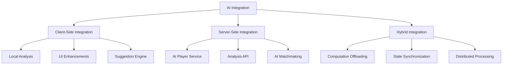
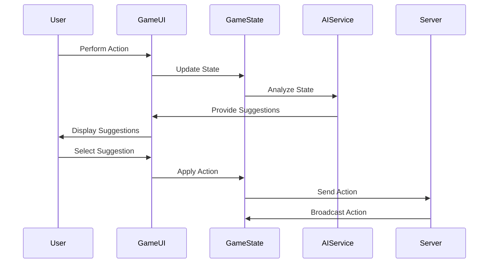

# AI Integration Guide

This guide provides a high-level overview of how to integrate AI into the Pokemon TCG Simulator. It focuses on the architectural considerations and integration points rather than the implementation details.

## Integration Approaches

There are several approaches to integrating AI into the Pokemon TCG Simulator:



### Client-Side Integration

Client-side integration involves running AI components directly in the browser:

**Advantages:**

- No server-side changes required
- Immediate response time
- Works offline
- Privacy (game data stays on client)

**Disadvantages:**

- Limited computational resources
- Browser compatibility issues
- Larger download size (AI models)
- Inconsistent performance across devices

### Server-Side Integration

Server-side integration involves running AI components on the server:

**Advantages:**

- More computational power
- Consistent performance
- Centralized updates
- Smaller client footprint

**Disadvantages:**

- Requires server infrastructure
- Network latency
- Server load considerations
- Potential scalability issues

### Hybrid Integration

Hybrid integration combines client and server approaches:

**Advantages:**

- Balances computational load
- Adaptable to different network conditions
- Can prioritize critical vs. non-critical AI features
- Graceful degradation when server unavailable

**Disadvantages:**

- More complex architecture
- Synchronization challenges
- More difficult to debug
- Requires careful design

## Integration Points

The Pokemon TCG Simulator provides several integration points for AI:

### Socket.IO Interface

The Socket.IO interface is the primary communication channel between clients and the server. AI can leverage this interface in several ways:

```javascript
// Connect to the game as an AI player
const socket = io('https://ptcgsim.online');
socket.on('connect', () => {
  socket.emit('joinGame', roomId, 'AI Player', false);
});

// Listen for game events
socket.on('pushAction', (data) => {
  // Process the action
  aiService.processAction(data);

  // Generate a response if it's the AI's turn
  if (isAITurn()) {
    const action = aiService.generateAction();
    socket.emit('pushAction', {
      action: action.type,
      counter: counter++,
      roomId: roomId,
      parameters: action.parameters,
    });
  }
});
```

### Action Processing Pipeline

The action processing pipeline can be extended to include AI analysis and suggestions:

```javascript
// Original process action function
const originalProcessAction = processAction;

// Enhanced process action function with AI
function enhancedProcessAction(user, emit, action, parameters) {
  // Call the original function
  originalProcessAction(user, emit, action, parameters);

  // Perform AI analysis
  const gameState = GameState.fromSystemState(
    systemState,
    selfZoneArrays,
    oppZoneArrays
  );
  const analysis = aiService.analyzeGameState(gameState);

  // Update UI with analysis
  updateAISuggestionPanel(analysis);
}

// Replace the original function
window.processAction = enhancedProcessAction;
```

### UI Integration

AI can be integrated into the UI to provide suggestions and analysis:

```javascript
// Add AI suggestion panel to the game UI
function addAISuggestionPanel() {
  const gameContainer = document.getElementById('gameContainer');
  const suggestionPanel = document.createElement('div');
  suggestionPanel.id = 'aiSuggestionPanel';
  suggestionPanel.className = 'ai-suggestion-panel';
  gameContainer.appendChild(suggestionPanel);

  // Initialize the panel
  const panel = new AISuggestionPanel(suggestionPanel);

  // Update the panel when the game state changes
  document.addEventListener('gameStateChanged', (event) => {
    const gameState = event.detail;
    const analysis = aiService.analyzeGameState(gameState);
    panel.update(analysis);
  });
}
```

## Data Flow

The data flow between the game and AI components is critical for effective integration:



### Game State to AI

The game state must be converted to a format that the AI can process:

```javascript
/**
 * Convert the system state to an AI-friendly format
 */
function convertToAIGameState(systemState, selfZones, oppZones) {
  const gameState = {
    players: {
      self: {
        active: convertCard(selfZones.active[0]),
        bench: selfZones.bench.map(convertCard),
        hand: selfZones.hand.map(convertCard),
        deck: {
          count: selfZones.deck.length,
          knownCards: selfZones.deck
            .filter((card) => card.image.public)
            .map(convertCard),
        },
        discard: selfZones.discard.map(convertCard),
        prizes: {
          count: selfZones.prizes.length,
          knownCards: selfZones.prizes
            .filter((card) => card.image.public)
            .map(convertCard),
        },
      },
      opponent: {
        active:
          oppZones.active.length > 0 ? convertCard(oppZones.active[0]) : null,
        bench: oppZones.bench.map(convertCard),
        hand: {
          count: oppZones.hand.length,
          knownCards: oppZones.hand
            .filter((card) => card.image.public)
            .map(convertCard),
        },
        deck: {
          count: oppZones.deck.length,
        },
        discard: oppZones.discard.map(convertCard),
        prizes: {
          count: oppZones.prizes.length,
        },
      },
    },
    turn: systemState.turn,
    activePlayer: systemState.activePlayer,
  };

  return gameState;
}

/**
 * Convert a card to an AI-friendly format
 */
function convertCard(card) {
  if (!card) return null;

  return {
    id: card.id,
    name: card.name,
    type: card.type,
    hp: card.hp,
    damage: card.damage || 0,
    energyAttached: card.attachedCards
      ? card.attachedCards.filter((c) => c.type.includes('Energy')).length
      : 0,
    specialConditions: card.specialConditions || [],
    attacks: card.attacks || [],
  };
}
```

### AI to Game Actions

AI recommendations must be converted to game actions:

```javascript
/**
 * Convert an AI recommendation to a game action
 */
function convertToGameAction(recommendation) {
  switch (recommendation.type) {
    case 'playCard':
      return {
        action: 'moveCard',
        parameters: [
          'self', // user
          'self', // initiator
          'hand', // origin zone
          recommendation.destination, // destination zone
          recommendation.cardIndex, // card index
          recommendation.targetIndex, // target index
          recommendation.playType, // play type (play, attach, evolve)
        ],
      };

    case 'attack':
      return {
        action: 'attack',
        parameters: [
          'self', // user
          recommendation.attackIndex, // attack index
        ],
      };

    case 'retreat':
      return {
        action: 'retreat',
        parameters: [
          'self', // user
          recommendation.benchIndex, // bench index
        ],
      };

    // Other action types

    default:
      console.error('Unknown recommendation type:', recommendation.type);
      return null;
  }
}
```

## Performance Considerations

AI integration can impact performance, so careful consideration is needed:

### Client-Side Performance

For client-side AI:

1. **Web Workers**: Use web workers for intensive calculations to avoid blocking the main thread
2. **Model Optimization**: Use optimized models for browser environments (e.g., TensorFlow.js)
3. **Incremental Updates**: Update AI analysis incrementally as the game state changes
4. **Lazy Loading**: Load AI components only when needed

```javascript
// Example of using a web worker for AI calculations
function createAIWorker() {
  const worker = new Worker('ai-worker.js');

  worker.onmessage = function (e) {
    const { type, data } = e.data;

    switch (type) {
      case 'analysis':
        updateAISuggestionPanel(data);
        break;

      case 'recommendation':
        highlightRecommendedCard(data);
        break;
    }
  };

  return {
    analyzeGameState: function (gameState) {
      worker.postMessage({
        type: 'analyze',
        gameState: gameState,
      });
    },

    generateRecommendation: function (gameState) {
      worker.postMessage({
        type: 'recommend',
        gameState: gameState,
      });
    },
  };
}
```

### Server-Side Performance

For server-side AI:

1. **Caching**: Cache analysis results for similar game states
2. **Rate Limiting**: Limit the frequency of AI requests
3. **Horizontal Scaling**: Scale AI services horizontally for multiple games
4. **Resource Allocation**: Allocate resources based on game complexity

```javascript
// Example of a simple caching mechanism for AI analysis
class AIAnalysisCache {
  constructor(maxSize = 100) {
    this.cache = new Map();
    this.maxSize = maxSize;
  }

  getKey(gameState) {
    // Create a simplified representation of the game state for caching
    // This should capture the essential elements while ignoring irrelevant details
    return JSON.stringify({
      activePokemon: gameState.players.self.active
        ? gameState.players.self.active.id
        : null,
      benchPokemon: gameState.players.self.bench.map((p) => p.id),
      handSize: gameState.players.self.hand.length,
      oppActivePokemon: gameState.players.opponent.active
        ? gameState.players.opponent.active.id
        : null,
      oppBenchPokemon: gameState.players.opponent.bench.map((p) => p.id),
      turn: gameState.turn,
    });
  }

  get(gameState) {
    const key = this.getKey(gameState);
    return this.cache.get(key);
  }

  set(gameState, analysis) {
    const key = this.getKey(gameState);

    // Evict oldest entry if cache is full
    if (this.cache.size >= this.maxSize) {
      const oldestKey = this.cache.keys().next().value;
      this.cache.delete(oldestKey);
    }

    this.cache.set(key, analysis);
  }
}
```

## Error Handling and Fallbacks

Robust error handling is essential for AI integration:

```javascript
/**
 * AI service with error handling and fallbacks
 */
class RobustAIService {
  constructor() {
    this.primaryService = new AIService();
    this.fallbackService = new SimpleFallbackAIService();
    this.errorCount = 0;
    this.maxErrors = 3;
  }

  analyzeGameState(gameState) {
    try {
      // Try the primary service
      const analysis = this.primaryService.analyzeGameState(gameState);
      this.errorCount = 0; // Reset error count on success
      return analysis;
    } catch (error) {
      console.error('AI analysis error:', error);
      this.errorCount++;

      // Switch to fallback if too many errors
      if (this.errorCount >= this.maxErrors) {
        console.warn('Switching to fallback AI service due to repeated errors');
        return this.fallbackService.analyzeGameState(gameState);
      }

      // Return a basic analysis for this request
      return {
        boardStrength: { self: 0.5, opponent: 0.5 },
        recommendedActions: [],
      };
    }
  }

  // Other methods with similar error handling
}
```

## User Experience Considerations

AI integration should enhance the user experience:

### Transparency

Users should understand what the AI is doing:

```javascript
/**
 * Explain AI recommendations to users
 */
function explainRecommendation(recommendation) {
  switch (recommendation.type) {
    case 'playCard':
      return `Play ${recommendation.cardName} to ${recommendation.destination} because ${recommendation.reason}`;

    case 'attack':
      return `Use the attack "${recommendation.attackName}" because ${recommendation.reason}`;

    case 'retreat':
      return `Retreat to ${recommendation.pokemonName} because ${recommendation.reason}`;

    default:
      return `Recommended action: ${recommendation.type}`;
  }
}
```

### User Control

Users should have control over AI assistance:

```javascript
/**
 * AI settings panel for user control
 */
class AISettingsPanel {
  constructor(container) {
    this.container = container;
    this.settings = {
      enabled: true,
      suggestionLevel: 'basic',
      autoPlay: false,
      showProbabilities: true,
      showEvaluation: true,
    };

    // Load settings from localStorage
    const savedSettings = localStorage.getItem('aiSettings');
    if (savedSettings) {
      this.settings = JSON.parse(savedSettings);
    }

    this.initialize();
  }

  initialize() {
    // Create UI elements
    // ...
    // Add event listeners
    // ...
  }

  updateSettings() {
    // Update settings based on UI
    // ...

    // Save settings to localStorage
    localStorage.setItem('aiSettings', JSON.stringify(this.settings));

    // Emit a settings changed event
    const event = new CustomEvent('aiSettingsChanged', {
      detail: this.settings,
    });
    document.dispatchEvent(event);
  }
}
```

### Progressive Disclosure

Introduce AI features gradually:

```javascript
/**
 * Progressive AI feature disclosure
 */
class ProgressiveAIFeatures {
  constructor() {
    this.userLevel = 'beginner';
    this.enabledFeatures = new Set(['basicSuggestions']);
    this.initialize();
  }

  initialize() {
    // Track user actions to determine level
    document.addEventListener('gameAction', (event) => {
      this.trackAction(event.detail);
    });

    // Periodically update user level
    setInterval(() => {
      this.updateUserLevel();
    }, 60000); // Check every minute
  }

  trackAction(action) {
    // Track user actions to determine expertise
    // ...
  }

  updateUserLevel() {
    // Update user level based on tracked actions
    // ...

    // Enable features based on user level
    if (this.userLevel === 'intermediate') {
      this.enabledFeatures.add('probabilityCalculation');
      this.enabledFeatures.add('detailedSuggestions');
    } else if (this.userLevel === 'advanced') {
      this.enabledFeatures.add('strategicAnalysis');
      this.enabledFeatures.add('opponentPrediction');
    }

    // Emit an event for feature changes
    const event = new CustomEvent('aiFeaturesChanged', {
      detail: Array.from(this.enabledFeatures),
    });
    document.dispatchEvent(event);
  }

  isFeatureEnabled(feature) {
    return this.enabledFeatures.has(feature);
  }
}
```

## Testing and Validation

Testing AI integration is crucial for reliability:

### Unit Testing

Test individual AI components:

```javascript
/**
 * Test the board evaluation function
 */
function testBoardEvaluation() {
  // Create test cases
  const testCases = [
    {
      name: 'Empty board',
      gameState: new GameState(),
      expectedSelf: 0,
      expectedOpponent: 0,
    },
    {
      name: 'Self advantage',
      gameState: createGameStateWithAdvantage('self'),
      expectedSelf: (value) => value > 0,
      expectedOpponent: (value) => value >= 0,
    },
    {
      name: 'Opponent advantage',
      gameState: createGameStateWithAdvantage('opponent'),
      expectedSelf: (value) => value >= 0,
      expectedOpponent: (value) => value > 0,
    },
  ];

  // Run tests
  testCases.forEach((testCase) => {
    console.log(`Running test: ${testCase.name}`);

    const evaluation = evaluateBoard(testCase.gameState);

    // Check self score
    const selfCheck =
      typeof testCase.expectedSelf === 'function'
        ? testCase.expectedSelf(evaluation.self)
        : evaluation.self === testCase.expectedSelf;

    // Check opponent score
    const oppCheck =
      typeof testCase.expectedOpponent === 'function'
        ? testCase.expectedOpponent(evaluation.opponent)
        : evaluation.opponent === testCase.expectedOpponent;

    console.assert(selfCheck, `Self score check failed: ${evaluation.self}`);
    console.assert(
      oppCheck,
      `Opponent score check failed: ${evaluation.opponent}`
    );
  });
}
```

### Integration Testing

Test AI integration with the game:

```javascript
/**
 * Test AI integration with the game
 */
function testAIIntegration() {
  // Set up a test game
  const gameState = createTestGameState();
  const aiService = new AIService();

  // Test analysis
  console.log('Testing AI analysis...');
  const analysis = aiService.analyzeGameState(gameState);
  console.assert(analysis.boardStrength, 'Board strength should be present');
  console.assert(
    analysis.recommendedActions.length > 0,
    'Should have recommended actions'
  );

  // Test action execution
  console.log('Testing AI action execution...');
  const action = aiService.generateMove(gameState);
  const newState = gameState.clone();
  newState.applyAction(action);
  console.assert(newState !== gameState, 'Action should change the game state');

  // Test UI integration
  console.log('Testing AI UI integration...');
  const suggestionPanel = new AISuggestionPanel(document.body);
  suggestionPanel.update(analysis);
  console.assert(
    suggestionPanel.panel.querySelector('.ai-board-analysis'),
    'Board analysis should be displayed'
  );
  console.assert(
    suggestionPanel.panel.querySelector('.ai-recommended-actions'),
    'Recommended actions should be displayed'
  );
}
```

### User Testing

Gather feedback from users:

```javascript
/**
 * AI feedback collection
 */
class AIFeedbackCollector {
  constructor() {
    this.feedback = [];
    this.initialize();
  }

  initialize() {
    // Add feedback button to AI suggestion panel
    const suggestionPanel = document.querySelector('.ai-suggestion-panel');
    if (suggestionPanel) {
      const feedbackButton = document.createElement('button');
      feedbackButton.className = 'ai-feedback-button';
      feedbackButton.textContent = 'Rate this suggestion';
      feedbackButton.addEventListener('click', () => {
        this.showFeedbackForm();
      });
      suggestionPanel.appendChild(feedbackButton);
    }
  }

  showFeedbackForm() {
    // Show a feedback form
    const form = document.createElement('div');
    form.className = 'ai-feedback-form';
    form.innerHTML = `
      <h3>Rate this AI suggestion</h3>
      <div class="rating">
        <button data-rating="1">👎</button>
        <button data-rating="2">👌</button>
        <button data-rating="3">👍</button>
      </div>
      <textarea placeholder="Additional comments (optional)"></textarea>
      <button class="submit">Submit</button>
      <button class="cancel">Cancel</button>
    `;

    // Add event listeners
    form.querySelector('.submit').addEventListener('click', () => {
      const rating = form.querySelector('.rating button.selected')?.dataset
        .rating;
      const comments = form.querySelector('textarea').value;

      if (rating) {
        this.submitFeedback(rating, comments);
        document.body.removeChild(form);
      }
    });

    form.querySelector('.cancel').addEventListener('click', () => {
      document.body.removeChild(form);
    });

    form.querySelectorAll('.rating button').forEach((button) => {
      button.addEventListener('click', () => {
        form
          .querySelectorAll('.rating button')
          .forEach((b) => b.classList.remove('selected'));
        button.classList.add('selected');
      });
    });

    document.body.appendChild(form);
  }

  submitFeedback(rating, comments) {
    // Get current game state and AI suggestion
    const gameState = GameState.fromSystemState(
      systemState,
      selfZoneArrays,
      oppZoneArrays
    );
    const aiService = new AIService();
    const analysis = aiService.analyzeGameState(gameState);

    // Create feedback object
    const feedback = {
      timestamp: new Date().toISOString(),
      rating: parseInt(rating),
      comments: comments,
      gameState: gameState,
      aiAnalysis: analysis,
    };

    // Store feedback
    this.feedback.push(feedback);
    localStorage.setItem('aiFeedback', JSON.stringify(this.feedback));

    // Send feedback to server if online
    if (navigator.onLine) {
      fetch('https://ptcgsim.online/api/ai-feedback', {
        method: 'POST',
        headers: {
          'Content-Type': 'application/json',
        },
        body: JSON.stringify(feedback),
      }).catch((error) => {
        console.error('Error sending feedback:', error);
      });
    }
  }
}
```

## Conclusion

AI integration into the Pokemon TCG Simulator requires careful consideration of architecture, performance, user experience, and testing. By following the guidelines in this document, you can create a seamless integration that enhances the game experience without disrupting existing functionality.

For implementation details, see the [AI Implementation](/docs/ai-enhancement/implementation) section.
