# AI Enhancement Opportunities

The Pokemon TCG Simulator provides numerous opportunities for AI enhancement. This document outlines key areas where AI can be integrated to improve gameplay, provide assistance, and create challenging opponents.

## Overview

AI can enhance the Pokemon TCG Simulator in several ways:

```mermaid
graph TD
    AI[AI Enhancement] --> Analysis[Game State Analysis]
    AI --> Decision[Decision Making]
    AI --> Assistance[Player Assistance]
    AI --> Opponent[AI Opponent]
    AI --> Learning[Learning & Tutorial]

    Analysis --> BoardEvaluation[Board Evaluation]
    Analysis --> ProbabilityCalculation[Probability Calculation]
    Analysis --> DeckTracking[Deck Tracking]

    Decision --> MoveGeneration[Move Generation]
    Decision --> StrategyFormulation[Strategy Formulation]
    Decision --> RiskAssessment[Risk Assessment]

    Assistance --> SuggestionEngine[Suggestion Engine]
    Assistance --> ExplanationSystem[Explanation System]
    Assistance --> DeckBuilding[Deck Building Assistant]

    Opponent --> DifficultyLevels[Difficulty Levels]
    Opponent --> PlayStyles[Different Play Styles]
    Opponent --> AdaptiveBehavior[Adaptive Behavior]

    Learning --> TutorialSystem[Tutorial System]
    Learning --> RuleExplanation[Rule Explanation]
    Learning --> SkillProgression[Skill Progression]
```

## Game State Analysis

AI can analyze the game state to provide insights and inform decision-making:

### Board Evaluation

- **Current Position Strength**: Evaluate the relative strength of each player's board position
- **Card Value Assessment**: Determine the value of cards in hand based on the current game state
- **Threat Detection**: Identify potential threats from the opponent's board position
- **Energy Efficiency**: Analyze energy distribution and efficiency

### Probability Calculation

- **Draw Probabilities**: Calculate the probability of drawing specific cards
- **Prize Card Prediction**: Estimate the likelihood of specific cards being in the prize cards
- **Outcome Simulation**: Simulate possible outcomes of actions with probability estimates

### Deck Tracking

- **Remaining Cards**: Track cards remaining in the deck
- **Opponent Deck Prediction**: Predict the opponent's deck composition based on cards played
- **Card Usage Patterns**: Analyze patterns in card usage for both players

## Decision Making

AI can make decisions or suggest optimal plays:

### Move Generation

- **Legal Move Enumeration**: Generate all legal moves in a given game state
- **Move Ranking**: Rank moves based on their potential effectiveness
- **Sequence Planning**: Plan sequences of moves for future turns

### Strategy Formulation

- **Game Plan Development**: Develop overall game plans based on deck composition
- **Adaptation**: Adjust strategy based on the opponent's actions
- **Win Condition Identification**: Identify and pursue the most likely path to victory

### Risk Assessment

- **Risk/Reward Analysis**: Evaluate the risk and potential reward of different actions
- **Resource Management**: Optimize the use of limited resources (energy, supporters, etc.)
- **Defensive Play**: Identify when to play defensively vs. aggressively

## Player Assistance

AI can assist players in making decisions and understanding the game:

### Suggestion Engine

- **Move Suggestions**: Suggest optimal moves to the player
- **Explanation**: Explain why a suggested move is optimal
- **Alternative Options**: Present alternative moves with their pros and cons

### Explanation System

- **Decision Rationale**: Explain the reasoning behind AI decisions
- **Game State Analysis**: Provide analysis of the current game state
- **Learning Opportunities**: Highlight learning opportunities from game situations

### Deck Building Assistant

- **Card Synergy Analysis**: Analyze card synergies within a deck
- **Meta Analysis**: Provide insights on the current meta and effective strategies
- **Deck Improvement Suggestions**: Suggest improvements to player-built decks

## AI Opponent

AI can serve as an opponent for single-player gameplay:

### Difficulty Levels

- **Beginner**: Simple decision-making suitable for new players
- **Intermediate**: More advanced strategy with occasional suboptimal plays
- **Expert**: Highly optimized play using advanced strategies
- **Champion**: Play at the level of top human players

### Different Play Styles

- **Aggressive**: Focus on quick attacks and pressure
- **Control**: Focus on disruption and resource denial
- **Setup**: Focus on building a powerful board position
- **Balanced**: Balanced approach adapting to the game state

### Adaptive Behavior

- **Player Skill Matching**: Adjust difficulty based on player skill
- **Learning from Games**: Improve based on previous games against the player
- **Deck-Specific Strategies**: Adapt strategies based on the player's deck

## Learning and Tutorial System

AI can help players learn the game:

### Tutorial System

- **Interactive Tutorials**: Guide players through game mechanics
- **Scenario-Based Learning**: Present specific scenarios to teach concepts
- **Progressive Difficulty**: Gradually introduce more complex concepts

### Rule Explanation

- **Contextual Rule Clarification**: Explain rules relevant to the current game state
- **Card Interaction Explanation**: Clarify how specific cards interact
- **Error Prevention**: Warn about potential rule violations or misplays

### Skill Progression

- **Skill Assessment**: Evaluate player skill level
- **Personalized Learning Path**: Suggest areas for improvement
- **Achievement System**: Track progress and achievements

## Technical Implementation Approaches

### Machine Learning Models

- **Supervised Learning**: Train models on expert gameplay data
- **Reinforcement Learning**: Allow AI to learn through self-play
- **Neural Networks**: Use deep learning for complex pattern recognition

### Heuristic Approaches

- **Rule-Based Systems**: Implement expert knowledge as rules
- **Decision Trees**: Use decision trees for transparent decision-making
- **State Evaluation Functions**: Develop functions to evaluate game states

### Hybrid Approaches

- **ML + Heuristics**: Combine machine learning with expert knowledge
- **Search Algorithms**: Use search algorithms guided by learned evaluation functions
- **Ensemble Methods**: Combine multiple AI approaches for better results

## Integration Points

The Pokemon TCG Simulator architecture provides several integration points for AI:

### Client-Side Integration

- **UI Enhancements**: Add AI suggestion UI elements
- **Action Interception**: Intercept user actions for analysis
- **Visualization**: Visualize AI analysis and suggestions

### Server-Side Integration

- **AI Player Service**: Implement AI players as separate services
- **Analysis API**: Provide an API for game state analysis
- **Matchmaking**: Match players with appropriate AI opponents

### Socket.IO Interface

- **AI as a Player**: AI can connect as a player using the Socket.IO interface
- **Observer Mode**: AI can observe games to learn and provide analysis
- **Chat Integration**: AI can provide suggestions and analysis via chat

## Challenges and Considerations

### Performance

- **Real-Time Requirements**: AI must make decisions quickly
- **Client-Side Limitations**: Consider browser performance limitations
- **Server Load**: Balance server load when running AI on the server

### User Experience

- **Transparency**: Make AI decision-making transparent to users
- **Control**: Allow users to control the level of AI assistance
- **Learning Curve**: Ensure AI assistance helps with the learning curve

### Technical Complexity

- **Game Rule Encoding**: Accurately encode all game rules for AI
- **Card Interaction Complexity**: Handle complex card interactions
- **Keeping Up with New Cards**: Update AI for new card releases

## Next Steps

To implement AI enhancements:

1. **Start with Game State Representation**: Develop a clean representation of the game state for AI consumption
2. **Implement Basic Analysis**: Begin with simple board evaluation and probability calculation
3. **Develop Suggestion UI**: Create a UI for displaying AI suggestions
4. **Build Simple AI Opponent**: Implement a rule-based AI opponent
5. **Gather Gameplay Data**: Collect data for training more advanced models
6. **Iterate and Improve**: Continuously refine AI based on user feedback

For implementation details, see the [AI Implementation](/docs/ai-enhancement/implementation) section.
