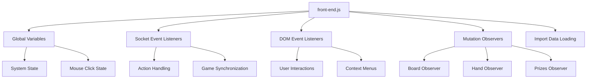

# Client-Side Architecture

The client-side of the Pokemon TCG Simulator is built with JavaScript and follows a modular structure. This document provides an overview of the client-side architecture.

## Overview

The client-side application is responsible for:

- Rendering the game UI
- Handling user interactions
- Processing game actions
- Communicating with the server
- Managing local game state



## Entry Point

The application's entry point is `front-end.js`, which initializes all the core components:

```javascript
export * from './initialization/global-variables/global-variables.js'; // Initialize all globally accessible variables

import { initializeDOMEventListeners } from './initialization/document-event-listeners/initialize-document-event-listeners.js';
import { loadImportData } from './initialization/load-import-data/load-import-data.js';
import { initializeMutationObservers } from './initialization/mutation-observers/initialize-mutation-observers.js';
import { initializeSocketEventListeners } from './initialization/socket-event-listeners/socket-event-listeners.js';

initializeSocketEventListeners(); // Initializes all event listeners for socket events
initializeDOMEventListeners(); // Initializes all event listeners for user's actions on html elements and the window
initializeMutationObservers(); // Initializes all mutation observers for user's actions on html elements
loadImportData(); // get the importData (if there is any), and load the content.
```

## Core Components

### Global Variables

The application uses global variables to maintain state across the application. The main global objects are:

- **systemState**: Stores game state information
- **mouseClick**: Tracks the currently selected card
- **selfContainer** and **oppContainer**: References to the player and opponent containers

```javascript
export const systemState = {
  coachingMode: false,
  isUndoInProgress: false,
  selfCounter: 0,
  selfActionData: [],
  oppActionData: [],
  spectatorCounter: 0,
  exportActionData: [],
  spectatorId: '',
  oppCounter: 0,
  isTwoPlayer: false,
  isReplay: false,
  replayActionData: [],
  turn: 0,
  // ... other properties
};
```

### Socket Event Listeners

Socket event listeners handle communication with the server. They are responsible for:

- Joining and leaving game rooms
- Sending and receiving game actions
- Synchronizing game state between players
- Handling disconnections and reconnections

```javascript
export const initializeSocketEventListeners = () => {
  socket.on('joinGame', () => {
    // Handle joining a game
  });

  socket.on('pushAction', (data) => {
    // Handle receiving an action from another player
  });

  socket.on('syncCheck', (data) => {
    // Handle synchronization checks
  });

  // ... other event listeners
};
```

### DOM Event Listeners

DOM event listeners handle user interactions with the UI. They are organized into several categories:

- **Card Context Menu**: Handles right-click menus on cards
- **Sidebox**: Manages the sidebar UI elements
- **Table**: Handles interactions with the game board
- **Window**: Manages window-level events

### Mutation Observers

Mutation observers watch for changes to the DOM and update the UI accordingly. They include:

- **Board Observer**: Watches for changes to the game board
- **Hand Observer**: Watches for changes to the player's hand
- **Prizes Observer**: Watches for changes to the prize cards
- **Stadium Observer**: Watches for changes to the stadium card

## Game Mechanics Implementation

### Card System

Cards are represented by the `Card` class, which encapsulates:

- Card properties (name, type)
- Image element
- Event listeners for interactions

```javascript
export class Card {
  name;
  type;
  user;
  image;

  constructor(user, name, type, imageURL) {
    this.user = user;
    this.name = name;
    this.type = type;
    // ... initialize image and event listeners
  }
}
```

### Zone System

The game board is divided into zones, each with specific purposes. Zones are managed by the `getZone` function:

```javascript
export const getZone = (user, zoneId) => {
  // ... determine document and arrays

  return {
    array, // Array of cards in the zone
    element, // DOM element for the zone
    elementCover, // Cover element for certain zones
    getCount, // Function to get the number of cards
  };
};
```

### Action System

The action system processes user actions and game events. Key components include:

- **moveCard**: Moves cards between zones
- **attachCard**: Attaches cards to other cards
- **evolveCard**: Evolves Pokemon cards
- **processAction**: Processes and synchronizes actions

## Data Flow

1. User interacts with the UI (drag, click, context menu)
2. Event listener processes the interaction
3. Action is created and processed locally
4. Action is sent to the server via Socket.IO
5. Server broadcasts the action to other players
6. Other players receive and process the action
7. UI is updated to reflect the action

## Optimization Techniques

The client-side application uses several optimization techniques:

- **Preloading Images**: Card images are preloaded to improve performance
- **Event Delegation**: Event listeners are attached to container elements
- **Mutation Observers**: DOM changes are observed to update the UI efficiently
- **Action Batching**: Multiple actions can be batched for efficiency

## AI Integration Considerations

When integrating AI into the client-side architecture, consider:

- **Action Interception**: AI can intercept and analyze user actions
- **UI Augmentation**: AI can provide suggestions through the UI
- **State Analysis**: AI can analyze the game state for optimal plays
- **Event Handling**: AI can listen to the same events as human players

For more details on AI integration, see the [AI Enhancement](/docs/ai-enhancement/opportunities) section.
