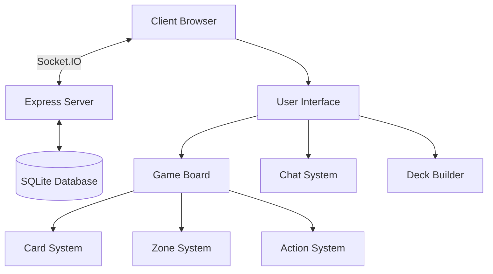
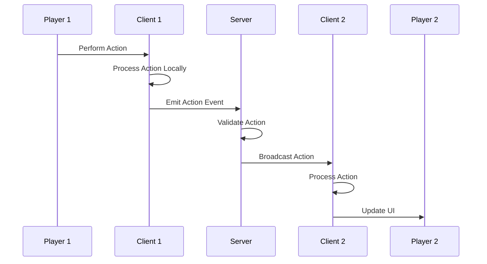

# System Architecture Overview

The Pokemon TCG Simulator is built with a client-server architecture that enables real-time multiplayer gameplay. This document provides a high-level overview of the system architecture.

## High-Level Architecture

The system consists of two main components:

1. **Client-Side Application**: A web-based frontend built with JavaScript
2. **Server-Side Application**: A Node.js server using Express and Socket.IO

## Client-Server Communication

The client and server communicate using Socket.IO, which provides real-time, bidirectional communication. This enables:

- Real-time game state synchronization between players
- Chat functionality
- Game state persistence
- Spectator mode

## Key Components

### Client-Side Components

- **User Interface**: Manages the visual representation of the game
- **Game Board**: Handles the game board layout and interactions
- **Card System**: Manages card data, rendering, and interactions
- **Zone System**: Manages different game zones (deck, hand, active, bench, etc.)
- **Action System**: Processes user actions and game events

### Server-Side Components

- **Express Server**: Serves the web application
- **Socket.IO Server**: Manages real-time communication
- **Room Management**: Handles game rooms and player connections
- **Game State Persistence**: Stores and retrieves game states using SQLite

## Data Flow

The following diagram illustrates the data flow in the system:

## Synchronization Mechanism

To ensure game state consistency between players, the system uses:

1. **Action Counters**: Each player maintains a counter for actions
2. **Action History**: Actions are stored in an array for replay and undo functionality
3. **Resynchronization**: Periodic checks ensure players are in sync

## Scalability Considerations

The current architecture supports:

- Multiple concurrent game rooms
- Spectator mode for observers
- Game state persistence for sharing and resuming games

For future scaling, consider:

- Horizontal scaling of Socket.IO servers
- Improved database architecture for larger user bases
- Caching mechanisms for frequently accessed data

## AI Integration Points

The architecture provides several integration points for AI systems:

- **Socket.IO Interface**: AI can connect as a player using the same interface
- **Action Processing**: AI can analyze and generate game actions
- **Game State Observer**: AI can monitor the game state for analysis

These integration points are explored in more detail in the [AI Enhancement](/docs/ai-enhancement/opportunities) section.
