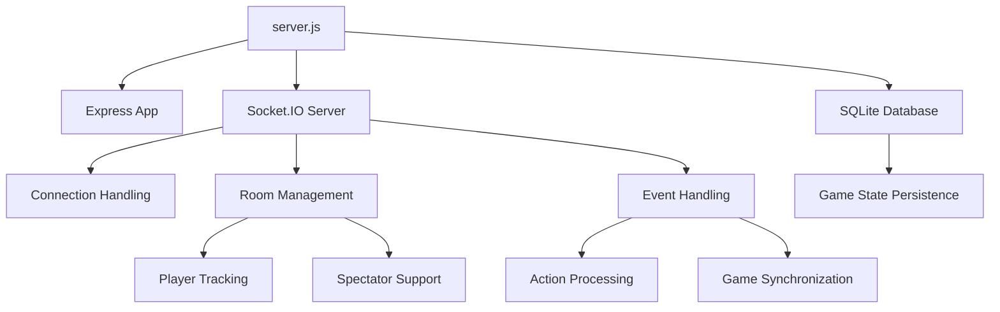

# Server-Side Architecture

The server-side of the Pokemon TCG Simulator is built with Node.js, Express, and Socket.IO. This document provides an overview of the server-side architecture.

## Overview

The server is responsible for:

- Serving the web application
- Managing real-time communication between clients
- Handling game rooms and player connections
- Storing and retrieving game states
- Synchronizing game actions between players



## Server Components

### Express Server

The Express server serves the web application and handles HTTP requests:

```javascript
const app = express();
app.set('view engine', 'ejs');
app.set('views', clientDir);
app.use(cors());
app.use(express.static(clientDir));

app.get('/', (_, res) => {
  res.render('index', { importDataJSON: null });
});

app.get('/import', (req, res) => {
  const key = req.query.key;
  if (!key) {
    return res.status(400).json({ error: 'Key parameter is missing' });
  }

  db.get('SELECT value FROM KeyValuePairs WHERE key = ?', [key], (err, row) => {
    if (err) {
      return res.status(500).json({ error: 'Internal server error' });
    }
    if (row) {
      res.render('index', { importDataJSON: row.value });
    } else {
      res.status(404).json({ error: 'Key not found' });
    }
  });
});
```

### Socket.IO Server

The Socket.IO server handles real-time communication between clients:

```javascript
const io = new Server(server, {
  connectionStateRecovery: {},
  cors: {
    origin: ['https://admin.socket.io', 'https://ptcgsim.online/'],
    credentials: true,
  },
});

io.on('connection', async (socket) => {
  // Handle socket connections and events
});
```

### SQLite Database

The server uses SQLite for game state persistence:

```javascript
const db = new sqlite3.Database(dbFilePath);

db.serialize(() => {
  db.run(
    'CREATE TABLE IF NOT EXISTS KeyValuePairs (key TEXT PRIMARY KEY, value TEXT)'
  );
});
```

## Room Management

The server manages game rooms using a Map data structure:

```javascript
const roomInfo = new Map();

// Function to periodically clean up empty rooms
const cleanUpEmptyRooms = () => {
  roomInfo.forEach((room, roomId) => {
    if (room.players.size === 0 && room.spectators.size === 0) {
      roomInfo.delete(roomId);
    }
  });
};

// Set up a timer to clean up empty rooms every 5 minutes
setInterval(cleanUpEmptyRooms, 5 * 60 * 1000);
```

Each room tracks players and spectators:

```javascript
socket.on('joinGame', (roomId, username, isSpectator) => {
  if (!roomInfo.has(roomId)) {
    roomInfo.set(roomId, { players: new Set(), spectators: new Set() });
  }
  const room = roomInfo.get(roomId);

  if (room.players.size < 2 || isSpectator) {
    socket.join(roomId);
    // Check if the user is a spectator or there are fewer than 2 players
    if (isSpectator) {
      room.spectators.add(username);
      socket.emit('spectatorJoin');
    } else {
      room.players.add(username);
      socket.emit('joinGame');
      socket.data.disconnectListener = () =>
        disconnectHandler(roomId, username);
      socket.on('disconnect', socket.data.disconnectListener);
    }
  } else {
    socket.emit('roomReject');
  }
});
```

## Event Handling

The server handles various Socket.IO events:

```javascript
// List of socket events
const events = [
  'leaveRoom',
  'requestAction',
  'pushAction',
  'resyncActions',
  'catchUpActions',
  'syncCheck',
  'appendMessage',
  'spectatorActionData',
  'initiateImport',
  'endImport',
  // ... other events
];

// Register event listeners using the common function
for (const event of events) {
  socket.on(event, (data) => {
    emitToRoom(event, data);
  });
}
```

## Game State Persistence

The server stores game states in the SQLite database:

```javascript
socket.on('storeGameState', (exportData) => {
  if (isDatabaseCapacityReached) {
    socket.emit(
      'exportGameStateFailed',
      'No more storage for game states! You should probably tell Michael/Xiao Xiao.'
    );
  } else {
    const key = generateRandomKey(4);
    db.run(
      'INSERT OR REPLACE INTO KeyValuePairs (key, value) VALUES (?, ?)',
      [key, exportData],
      (err) => {
        if (err) {
          socket.emit(
            'exportGameStateFailed',
            'Error exporting game! Please try again or save as a file.'
          );
        } else {
          socket.emit('exportGameStateSuccessful', key);
        }
      }
    );
  }
});
```

## Synchronization Mechanism

The server helps synchronize game state between players:

```javascript
socket.on('syncCheck', (data) => {
  const notSpectator = !(
    document.getElementById('spectatorModeCheckbox').checked &&
    systemState.isTwoPlayer
  );
  if (notSpectator && data.counter >= parseInt(systemState.oppCounter) + 1) {
    const data = {
      roomId: systemState.roomId,
      counter: systemState.oppCounter,
    };
    socket.emit('resyncActions', data);
  }
});

socket.on('resyncActions', () => {
  const notSpectator = !(
    document.getElementById('spectatorModeCheckbox').checked &&
    systemState.isTwoPlayer
  );
  if (notSpectator) {
    resyncActions();
  }
});

socket.on('catchUpActions', (data) => {
  const notSpectator = !(
    document.getElementById('spectatorModeCheckbox').checked &&
    systemState.isTwoPlayer
  );
  if (notSpectator) {
    catchUpActions(data.actionData);
  }
});
```

## Error Handling

The server includes error handling for various scenarios:

```javascript
// Error handling
this.server.onerror = (error) => console.error('[MCP Error]', error);
process.on('SIGINT', async () => {
  await this.server.close();
  process.exit(0);
});
```

## Security Considerations

The server implements several security measures:

1. **Admin Authentication**: The Socket.IO admin UI is protected with bcrypt-hashed passwords
2. **Database Size Monitoring**: The server monitors database size to prevent excessive growth
3. **Input Validation**: The server validates input parameters to prevent injection attacks

```javascript
// Bcrypt Configuration
const saltRounds = 10;
const plainPassword = process.env.ADMIN_PASSWORD || 'defaultPassword';
const hashedPassword = bcrypt.hashSync(plainPassword, saltRounds);

// Socket.IO Admin Instrumentation
instrument(io, {
  auth: {
    type: 'basic',
    username: 'admin',
    password: hashedPassword,
  },
  mode: 'development',
});
```

## Scalability Considerations

The current server architecture has some limitations for scaling:

1. **In-Memory Room Storage**: Room information is stored in memory, which doesn't scale across multiple server instances
2. **Single SQLite Database**: The database is a potential bottleneck for high-traffic scenarios
3. **No Load Balancing**: There's no built-in load balancing for Socket.IO connections

For future scaling, consider:

- Using Redis for distributed room management
- Implementing a more robust database solution (PostgreSQL, MongoDB)
- Setting up load balancing for Socket.IO servers
- Implementing horizontal scaling with sticky sessions

## AI Integration Considerations

When integrating AI into the server-side architecture, consider:

- **AI as a Player**: AI can connect as a player using the Socket.IO interface
- **Server-Side AI Processing**: AI logic can run on the server to analyze game states
- **Action Validation**: The server can validate AI actions to ensure they follow game rules
- **Performance Impact**: AI processing may impact server performance, so consider separate services

For more details on AI integration, see the [AI Enhancement](/docs/ai-enhancement/opportunities) section.
