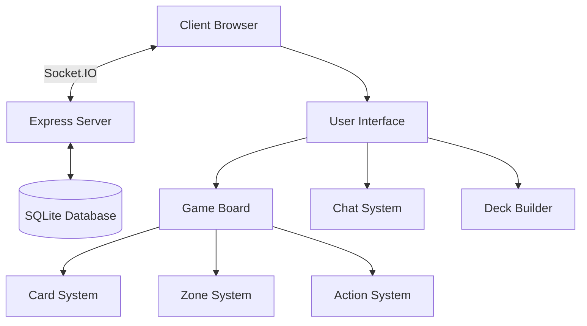

# Introduction

Welcome to the Pokemon TCG Simulator documentation. This documentation provides a comprehensive overview of the simulator's architecture and identifies opportunities for AI enhancement.

## Overview

The Pokemon TCG Simulator is a web-based application that allows users to play the Pokemon Trading Card Game online. It follows a client-server architecture with real-time communication via Socket.IO.

This documentation is designed to help developers understand the system architecture, game mechanics, and opportunities for AI enhancement.

## Purpose of This Documentation

This documentation serves several key purposes:

1. **System Understanding**: Provides a comprehensive overview of the Pokemon TCG Simulator's architecture, components, and functionality.

2. **Developer Onboarding**: Helps new developers quickly understand the codebase and how different parts of the system interact.

3. **AI Enhancement Guide**: Identifies opportunities for AI integration and provides guidelines for implementing AI features.

4. **Best Practices**: Documents patterns and approaches used in the codebase to maintain consistency in future development.

## Documentation Structure

This documentation is organized into the following sections:

- **Architecture**: Overview of the system architecture, including client-side and server-side components.
- **Core Components**: Detailed information about the main components of the system.
- **Game Mechanics**: Explanation of the core game mechanics and how they are implemented.
- **Data Structures**: Documentation of the key data structures used in the application.
- **Communication Protocol**: Details about the Socket.IO-based communication protocol.
- **AI Enhancement**: Opportunities and guidelines for AI integration.

## Getting Started

To get started with the Pokemon TCG Simulator:

1. Clone the repository
2. Install dependencies
3. Run the development server

For more details, see the [GitHub repository](https://github.com/your-github-username/pokemon-tcg-sim).
